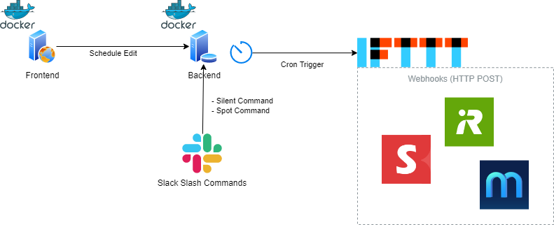

スマートホーム スケジューラー
===

## 概要

スマートホームのスケジューリング機能を集約するソリューションです。  

一般的にスマートホーム系機器はスマホアプリからスケジュール設定ができますが、アプリごと/機器ごと個別の設定で煩雑となる上に夜間等実行したくないタイミングを制御することに対応できないものもあります。  
また、スケジュールの設定も曜日や時刻の決め打ちによるものが多く、より高度で柔軟なルールには対応できないものが多いです。  

このソリューションでは、各種スマートホーム系機器のスケジュール管理を集約し、さらに柔軟なルール設定により日没時間など年間を通した時間的な変化に追従することができます。  


## 構成




## 依存関係

- Docker
- Node.js
  - [Frontend](./frontend/src/package.json)
    - React
    - Next.js
    - Bootstrap
    - CoreUI
    - FontAwesome
  - [Backend](./backend/src/package.json)
    - Express


## 環境構築

```bash
$ docker-compose up
```


## 使い方

http://localhost:8080/


## ライセンス

[MIT](LICENSE.md)  

[ICOOON MONO](https://icooon-mono.com/)  
このリポジトリーで使用しているアイコンの著作権は上記サイトの TopeconHeroes 様に帰属します。  


## 作者

[tissueMO](https://github.com/tissueMO)
